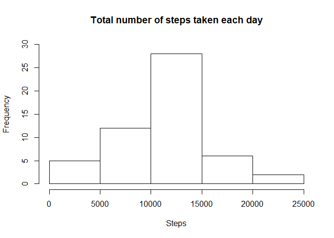
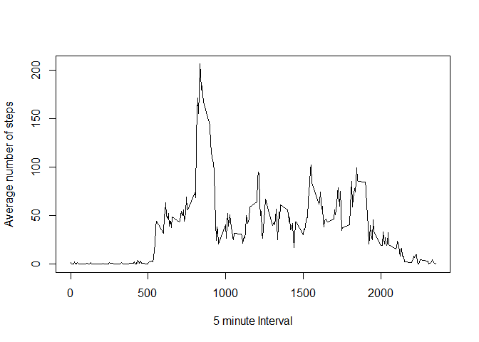
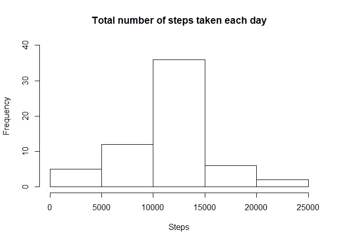
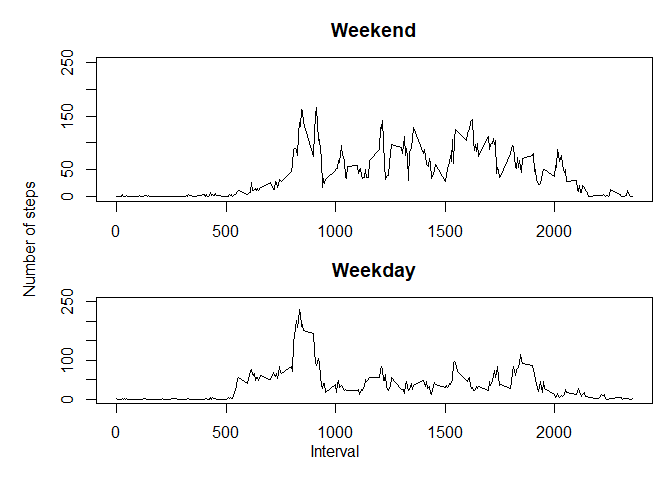

## Loading and preprocessing the data

```r
library(knitr)
 if(!file.exists("activity.csv")){
   unzip("activity.zip")
 }
data <- data.frame(read.csv("activity.csv"))
```


## What is mean total number of steps taken per day?

```r
first <- na.omit(data, cols="steps")

sums <- aggregate(steps ~ date, first, sum)

hist(sums$steps, ylim=c(0,30), main = "Total number of steps taken each day", xlab = "Steps")
```

<!-- -->

```r
stepMean <- format(round(as.numeric(mean(sums$steps)), 2), nsmall=2, big.mark=",")
stepMedian <- format(round(as.numeric(median(sums$steps)), 2), nsmall=2, big.mark=",")
```

#### The average number of steps taken in a day is 10,766.19 and the median value is 10,765.00  


## What is the average daily activity pattern?

```r
second <- na.omit(data, cols="steps")
second <- aggregate(steps ~ interval, second, mean)
plot(second$interval, second$steps, type = "l", xlab="5 minute Interval", ylab="Average number of steps")
```

<!-- -->

```r
maxInterval <- second[which.max(second$steps),]
```

#### The interval that contains the highest average number of steps accross all days is interval 835 with 206.1698113 steps.  


## Imputing missing values

```r
naValues <- data[is.na(data$steps),]
```

#### There are 2304 missing values    
    
    
#### To fill in missing values, the mean of the total number of steps per interval is used, since it's a quick method that works well for numerical values.    


```r
means <- aggregate(steps ~ interval, data, mean, na.rm=TRUE)

imputedData <- data
imputedData$steps <- by(imputedData, 1:nrow(imputedData), function(entry) { if(is.na(entry$steps)){ entry$steps <- means[means$interval == entry$interval,]$steps } else { entry$steps <- entry$steps } })

imputedSums <- aggregate(steps ~ date, imputedData, sum)

hist(imputedSums$steps, ylim=c(0,40), main = "Total number of steps taken each day", xlab = "Steps")
```

<!-- -->

```r
imputedMean <- format(round(as.numeric(mean(imputedSums$steps)), 2), nsmall=2, big.mark=",")
imputedMedian <- format(round(as.numeric(median(imputedSums$steps)), 2), nsmall=2, big.mark=",")
```

#### The average number of steps taken in a day is 10,766.19 and the median value is 10,766.19  

#### The mean value does not change with the imputed values, but the median value does. Imputing the missing data using this method does not affect the mean since the mean is the value used to fill the data, but other measures can be affected (Like the median)  
  
## Are there differences in activity patterns between weekdays and weekends?

```r
weekend <- c("Saturday","Sunday")

imputedData$day <- by(imputedData, 1:nrow(imputedData), function(entry) { if(weekdays(as.Date(entry$date)) %in% weekend){ entry$day <- "weekend" } else { entry$day <- "weekday" } })

weekdayData <- aggregate(steps ~ interval, imputedData[imputedData$day == "weekday",], mean)
weekdayPlotData <- data.frame("weekday", weekdayData$steps, weekdayData$interval)
names(weekdayPlotData) <- c("day", "steps", "interval")

weekendData <- aggregate(steps ~ interval, imputedData[imputedData$day == "weekend",], mean)
weekendPlotData <- data.frame("weekend", weekendData$steps, weekendData$interval)
names(weekendPlotData) <- c("day", "steps", "interval")

#plotData <- rbind(weekdayPlotData, weekendPlotData)

par(mfrow=c(2,1))
par(mar = c(2, 5, 3, 1))
plot(weekendData$interval, weekendData$steps, type="l", main="Weekend", xlab = "", ylab = "", ylim=c(0,250))
par(mar = c(4, 5, 3, 1))
plot(weekdayData$interval, weekdayData$steps, type="l", main="Weekday", xlab = "", ylab = "", ylim=c(0,250))
mtext("Number of steps", side = 2, outer = TRUE, line = -2)
mtext("Interval", side = 1, outer = TRUE, line = -2)
```

<!-- -->
